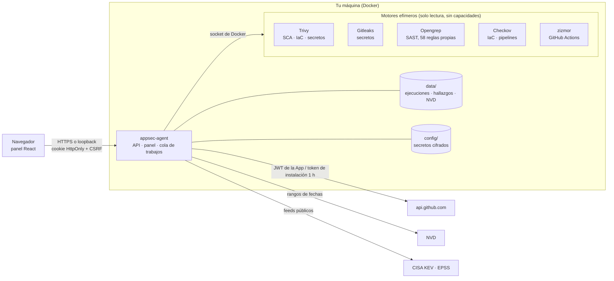

# Arquitectura

Tamandua es un único proceso Python (biblioteca estándar, `cryptography` para la GitHub App y `reportlab` para los PDF) que sirve el panel web, la API y los trabajos en segundo plano. Los motores de análisis corren como contenedores hermanos efímeros con el código montado en solo lectura, sin capacidades y con límites de memoria, CPU y procesos.



## Estructura del código

Monolito modular (`tamandua/`), con capas que comprueba import-linter en cada PR (`make arch`, ver `pyproject.toml`):

```
tamandua/
  cli/          línea de comandos (scan para CI, demo, usuarios…)
  app/          composición: servidor HTTP y rutas (http/), migraciones de datos al arrancar, estáticos del panel
  modules/      el negocio, un paquete por contexto; no importa de app/ ni de cli/
    identity/       usuarios, sesiones, TOTP
    sources/        repositorios, activos (identidad estable), dominios
    scanning/       motores (engines, config_engines), plan, inventario, análisis de repositorio, imagen y local, OWASP
    runs/           ejecuciones, cola de análisis y lotes
    findings/       registro y ciclo de vida, triage, exclusiones, guía de corrección, reverificación, plazos (SLA)
    intel/          avisos, KEV/EPSS, copia local de NVD, EUVD, fuentes y licencias
    compliance/     SBOM, VEX, kit CRA
    reporting/      informes PDF/Markdown, diseño común, Resumen
    integrations/   GitHub App, Jira, avisos (Slack/Teams/webhook), claves de IA
    pullrequests/   revisión de PR y vigilancia
    threats/        modelado de amenazas, diagrama e informe
    lab/            laboratorio sintético (tenant-api-lab) y datos de demostración; el producto no lo usa
  shared/       transversal sin negocio: logs, almacén cifrado, rutas; no importa de modules/
```

El panel (`web/src`) sigue la misma idea, por funcionalidad (Feature-Sliced Design ligero), con capas que comprueba
`tests/test_web_layers.py`: una capa no importa de las de arriba.

```
web/src/
  app/        composición: App (navegación), proveedores (TanStack Query)
  pages/      una pantalla por vista (Resumen, Hallazgos, CVE tracker, Cumplimiento…)
  features/   auth, onboarding, analyses, sources, findings, integrations, threats
  shared/     ui (Base UI + Tailwind), charts, api (cliente, tipos generados del OpenAPI, consultas), lib
```

Los datos del servidor van con TanStack Query (`shared/api/queries.ts`): caché compartida entre vistas y sondeo solo
mientras hay algo en marcha. Los tipos de las rutas migradas salen del OpenAPI (`make openapi`).

La seguridad de la API está en un solo sitio (`app/http/core.py`): host permitido → CSRF (Origin + cabecera de acción) →
sesión → segundo factor → rol → tamaño del cuerpo. Los manejadores no leen cabeceras ni cookies por su cuenta.
El panel React + TypeScript (`web/`) se compila a `tamandua/app/static/`.

Servicios (compose): `appsec` (panel y API con FastAPI, sin acceso a Docker), `worker` (ejecuta los análisis de la
cola y las tareas periódicas; el único con el socket de Docker; se puede escalar y las tareas periódicas solo las corre el
líder, elegido con un cerrojo de PostgreSQL), `postgres` y `opengrep` (solo construye la imagen del motor). La cola
(`jobs`) y el buzón de avisos (`outbox`, con reintentos) viven en PostgreSQL: un reinicio no pierde lo encolado.
`python -m appsec_agent` y las variables `APPSEC_AGENT_*` siguen funcionando.

## Flujo de un análisis

1. Pulsas **Analizar** o se abre un PR en un repositorio vigilado.
2. La API encola el trabajo y responde al momento; el panel muestra el progreso en vivo.
3. El trabajador pide a GitHub un token de instalación de una hora (en memoria) y descarga una instantánea del repositorio en `data/work/`.
4. Se calcula el plan (lenguajes, reglas aplicables, manifiestos, IaC) y se lanzan los motores uno a uno: instantánea en solo lectura, `--cap-drop ALL`, `no-new-privileges`, 3 GB de memoria, 2 CPU y 512 procesos como máximo. Gitleaks, Opengrep, Checkov y zizmor van **sin red**; Trivy la necesita para descargar su base de vulnerabilidades (cacheada en `data/trivy-cache/`) y no envía nada del repositorio.
5. Los resultados se normalizan, se deduplican por huella estable, se enriquecen con KEV/EPSS y se incorporan al registro del repositorio: lo que ya no aparece queda **remediado**.
6. Si era un PR, se publica un comentario único y un estado de commit según el umbral configurado.
7. La instantánea se borra.

## Datos en disco

```
PostgreSQL (volumen tamandua-pg; esquema con migraciones de Alembic en tamandua/app/alembic)
  runs                ejecuciones: fila de listado, registro completo, informe y SARIF (JSONB + columnas para filtrar)
  registry_*          registro de hallazgos por activo (estado, CVE con índice GIN) e idempotencia por ejecución
  triage_decisions    decisiones de triage con su historial
data/
  auth/             usuarios (scrypt), sesiones (hash), clave de firma de cookies
  runs/, findings/, triage.json  formato anterior: se importan una vez a PostgreSQL y quedan intactos para volver atrás
  feeds/            KEV, EPSS, NVD (cves.sqlite)
  trivy-cache/      base de vulnerabilidades de Trivy
  logs/app.log      JSON por línea, rotado (10 MB × 5), sin secretos
  integrations.json instalaciones de GitHub conectadas (identificador, cuenta, permisos)
  pr-watch.json     repositorios vigilados y PRs revisados
  data-version.json versión del formato de data/ y migraciones aplicadas
  backups/          copia de lo que tocó cada migración (se guardan las 5 últimas)
config/
  secrets.vault     secretos cifrados
  master.key        clave maestra (si no viene del entorno)
```

**Actualizar sin romper los datos.** Al arrancar (panel o CLI), `tamandua/app/data_migrations.py` compara la versión
guardada en `data-version.json` con la del código y aplica, en orden y una sola vez, las migraciones pendientes,
tras copiar a `data/backups/` solo lo que van a tocar. Cada paso guarda su versión: si uno falla, el siguiente
arranque reanuda desde ahí. Una instalación nueva nace en la última versión; unos datos de una versión más nueva
que el código (volver a una versión anterior) impiden arrancar en vez de arriesgarse a estropearlos.

## Decisiones de diseño

- **Sin dependencias web en el backend.** Menos superficie de ataque y menos actualizaciones de seguridad que seguir.
- **Sondeo en vez de webhooks.** El servidor no necesita ser accesible desde internet.
- **Una GitHub App por workspace**, con cuatro permisos. Para varias organizaciones, GitHub exige que pueda instalarse en cualquier cuenta; el administrador escoge explícitamente cuáles conectar al workspace. Una clave filtrada tendría acceso a todas las instalaciones de esa App, por lo que su custodia sigue siendo crítica.
- **Honestidad en los resultados.** Lo que no se pudo probar sale como `not_tested` con su motivo; un análisis incompleto nunca se presenta como «cero vulnerabilidades».
