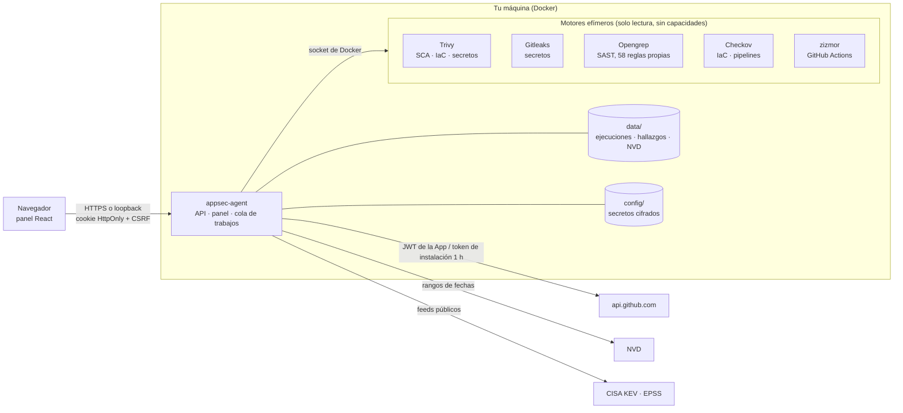

# Arquitectura

Tamandua es un único proceso Python (biblioteca estándar, `cryptography` para la GitHub App y `reportlab` para los PDF) que sirve el panel web, la API y los trabajos en segundo plano. Los motores de análisis corren como contenedores hermanos efímeros con el código montado en solo lectura, sin capacidades y con límites de memoria, CPU y procesos.



## Componentes

| Módulo | Qué hace |
| --- | --- |
| `api/` | Tabla de rutas con una sola tubería de seguridad: host permitido → CSRF (Origin + cabecera de acción) → sesión → segundo factor → rol → tamaño del cuerpo. Los manejadores no leen cabeceras ni cookies por su cuenta. |
| `auth.py` | Usuarios (scrypt), sesiones del lado del servidor, TOTP con códigos de respaldo, invitaciones y límite de intentos. |
| `vault.py` | Almacén de secretos AES-256-GCM en `config/`. |
| `github_app.py` | Verificación de la App, JWT RS256, tokens de instalación en memoria, lectura de repositorios y PRs, comentarios y estados de commit. |
| `jobs.py` / `worker.py` | Cola de análisis con un trabajador; al arrancar, lo que quedó a medias se marca como fallido. |
| `repository_scan.py` / `scanners.py` | Instantánea del repositorio, plan de escaneo y ejecución de los motores. |
| `findings_registry.py` | Estado actual por repositorio: cada hallazgo con su origen, primera y última vez, y remediación automática o manual. |
| `pr_watch.py` / `pr_review.py` | Vigilante de PRs por sondeo y revisión de lo que introduce cada commit. |
| `advisories.py` / `cve_db.py` | KEV, EPSS, OSV y la copia local de NVD con búsqueda (SQLite + FTS5). |
| `threat_model.py` / `inventory.py` | Modelos STRIDE a partir del inventario de los repositorios y de sus hallazgos. |
| `jira.py` | Exportación idempotente de hallazgos a Jira Cloud. |
| `web/` | Panel React + TypeScript con shadcn/ui; se compila a `appsec_agent/static/`. |

## Flujo de un análisis

1. Pulsas **Analizar** o se abre un PR en un repositorio vigilado.
2. La API encola el trabajo y responde al momento; el panel muestra el progreso en vivo.
3. El trabajador pide a GitHub un token de instalación de una hora (en memoria) y descarga una instantánea del repositorio en `data/work/`.
4. Se calcula el plan (lenguajes, reglas aplicables, manifiestos, IaC) y se lanzan los motores uno a uno: instantánea en solo lectura, `--cap-drop ALL`, `no-new-privileges`, 3 GB de memoria, 2 CPU y 512 procesos como máximo. Gitleaks, Opengrep, Checkov y zizmor van **sin red**; Trivy la necesita para descargar su base de vulnerabilidades (cacheada en `data/trivy-cache/`) y no envía nada del repositorio.
5. Los resultados se normalizan, se deduplican por huella estable, se enriquecen con KEV/EPSS y se incorporan al registro del repositorio: lo que ya no aparece queda **remediado**.
6. Si era un PR, se publica un comentario único y un estado de commit según el umbral configurado.
7. La instantánea se borra.

## Datos en disco

```
data/
  auth/             usuarios (scrypt), sesiones (hash), clave de firma de cookies
  runs/             una carpeta por ejecución + índice ligero para paginar
  findings/         registro de hallazgos por repositorio
  feeds/            KEV, EPSS, NVD (cves.sqlite)
  trivy-cache/      base de vulnerabilidades de Trivy
  logs/app.log      JSON por línea, rotado (10 MB × 5), sin secretos
  integrations.json instalaciones de GitHub conectadas (identificador, cuenta, permisos)
  pr-watch.json     repositorios vigilados y PRs revisados
config/
  secrets.vault     secretos cifrados
  master.key        clave maestra (si no viene del entorno)
```

## Decisiones de diseño

- **Sin dependencias web en el backend.** Menos superficie de ataque y menos actualizaciones de seguridad que seguir.
- **Sondeo en vez de webhooks.** El servidor no necesita ser accesible desde internet.
- **Una GitHub App por workspace**, con cuatro permisos. Para varias organizaciones, GitHub exige que pueda instalarse en cualquier cuenta; el administrador escoge explícitamente cuáles conectar al workspace. Una clave filtrada tendría acceso a todas las instalaciones de esa App, por lo que su custodia sigue siendo crítica.
- **Honestidad en los resultados.** Lo que no se pudo probar sale como `not_tested` con su motivo; un análisis incompleto nunca se presenta como «cero vulnerabilidades».
